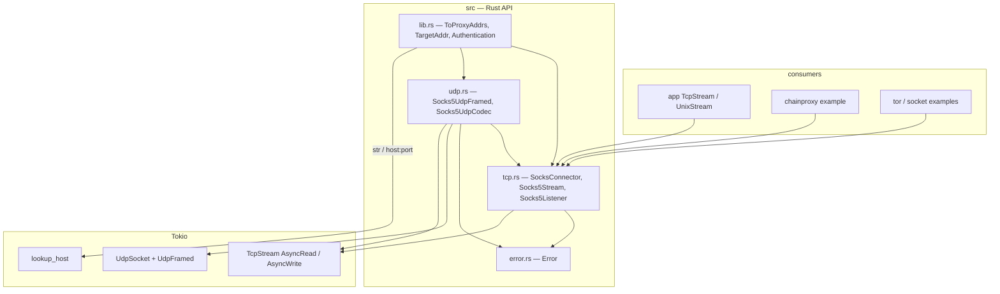

# better-socks architecture

Asynchronous SOCKS5 client for Tokio. CONNECT, BIND, and UDP ASSOCIATE
(RFC 1928) plus username/password auth (RFC 1929, cleartext). Optional `tor`
feature adds Tor `RESOLVE` / `RESOLVE_PTR`. No TLS-to-proxy, no SOCKS4, no
GSSAPI.

# Layers

