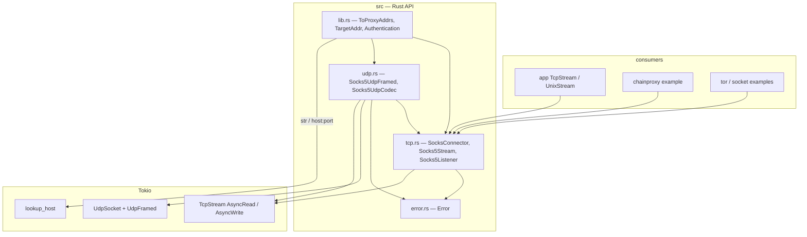
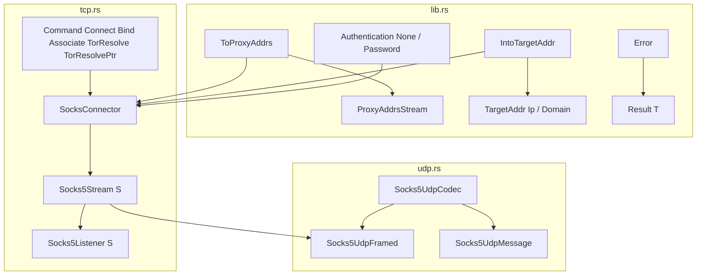
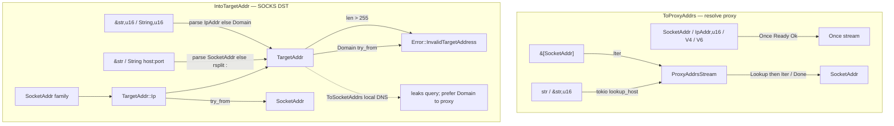
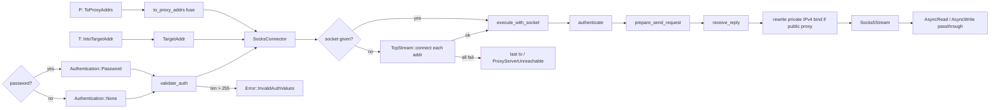
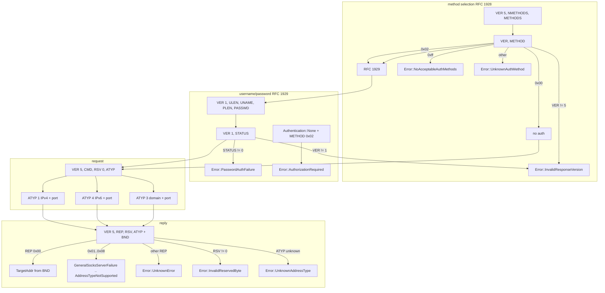
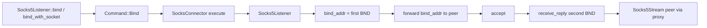

# better-socks architecture

Asynchronous SOCKS5 client for Tokio. CONNECT, BIND, and UDP ASSOCIATE
(RFC 1928) plus username/password auth (RFC 1929, cleartext). Optional `tor`
feature adds Tor `RESOLVE` / `RESOLVE_PTR`. No TLS-to-proxy, no SOCKS4, no
GSSAPI.

# Layers



# Public types



# Address conversion



# CONNECT lifecycle



# Handshake and request



# BIND lifecycle



# UDP ASSOCIATE

```mermaid
flowchart TB
    subgraph setup ["Socks5UdpFramed::connect"]
        bindu{"bind_addr?"}
        bindu -->|None| any["UdpSocket 0.0.0.0:0"]
        bindu -->|Some| spec[UdpSocket::bind]
        any --> local[local_addr]
        spec --> local
        local --> assoc["Socks5Stream::associate"]
        assoc --> framed["UdpFramed Socks5UdpCodec"]
        assoc --> relay["relay_socket_addr BND"]
        relay -->|"Ip"| sa[socks_addr]
        relay -->|"Domain"| inv[Error::InvalidTargetAddress]
    end

    subgraph io ["I/O"]
        sink["Sink Bytes, TargetAddr"]
        sink --> enc["encode header + payload"]
        enc --> send["send to socks_addr"]
        stream["Stream"]
        stream --> udp_in["framed.poll_next datagram"]
        stream --> tcp_ctl["poll_read control TCP"]
        tcp_ctl -->|EOF| end["Stream None"]
        tcp_ctl -->|data| ignore["ignore, keep waiting UDP"]
        tcp_ctl -->|Io| eio[Error::Io]
        udp_in --> dec[decode Socks5UdpMessage]
    end
```
